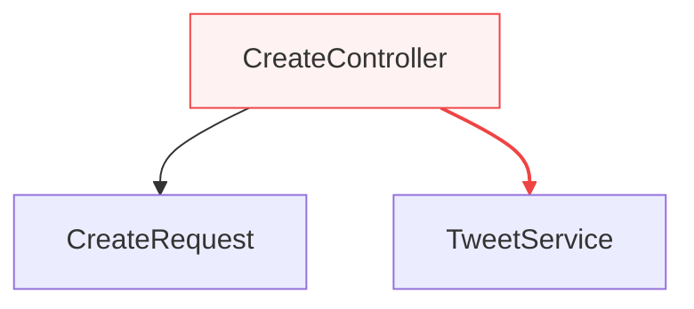

# Laravel DI Scope

[](https://packagist.org/packages/akito-tsukahara/laravel-di-scope)
[](https://github.com/AkitoTsukahara/laravel-di-scope/actions)
[](https://packagist.org/packages/akito-tsukahara/laravel-di-scope)

Laravelのサービスコンテナのバインディング情報を解析し、依存関係の可視化とアーキテクチャルールの検証を行うパッケージ。

## 特徴

- 🔍 **バインディング可視化**: サービスコンテナに登録された全バインディングを一覧表示
- 📂 **ディレクトリスキャン**: `app/`配下のクラスを自動スキャンして依存関係を解析
- 🎯 **メソッドインジェクション対応**: `__construct`、`__invoke`、`handle`メソッドの依存を解析
- 🌳 **依存ツリー構築**: クラス間の依存関係を再帰的に解決・表示
- ✅ **ルール検証**: 定義したアーキテクチャルールに違反する依存を検出
- 📊 **グラフ出力**: Mermaid形式で依存関係を可視化（違反は赤色でハイライト）
- 🔄 **CI連携**: 違反があればexit code 1を返すためCIパイプラインに組み込み可能

## 動作要件

- PHP 8.2以上
- Laravel 10.x / 11.x / 12.x

## インストール
```bash
composer require --dev akito-tsukahara/laravel-di-scope
```

## 設定

設定ファイルをpublish:
```bash
php artisan vendor:publish --tag=di-scope-config
```

### スキャン設定

`config/di-scope.php` でスキャン対象を設定:
```php
'scan' => [
    // スキャン対象ディレクトリ（base_path()からの相対パス）
    'paths' => [
        'app/',
        // 'packages/my-package/src/',
    ],

    // 除外ディレクトリ
    'exclude_paths' => [
        // 'app/Providers/',
    ],

    // 除外パターン（名前空間ベース、ワイルドカード対応）
    'exclude_patterns' => [
        'App\\Providers\\*',
    ],
],
```

### 依存解析の除外設定

フレームワークの依存など、グラフに含めたくないクラスを除外:
```php
'ignore' => [
    'Illuminate\\*',
    'Psr\\*',
    'Symfony\\*',
],
```

### アーキテクチャルール

レイヤー間の依存ルールを定義:
```php
'rules' => [
    // Domain層はInfrastructure層に依存してはいけない
    'App\\Domain\\*' => [
        'deny' => ['App\\Infrastructure\\*'],
        'allow' => ['App\\Domain\\*', 'App\\Application\\*'],
    ],

    // ControllerはServiceに直接依存してはいけない例
    'App\\Http\\Controllers\\*' => [
        'deny' => ['App\\Services\\*'],
        'allow' => ['App\\Http\\Requests\\*'],
    ],
],
```

## 使い方

### バインディング一覧を表示
```bash
php artisan di:list

# singletonのみ表示
php artisan di:list --type=singleton

# 検索
php artisan di:list --search=Repository
```

### ルール違反を検出
```bash
php artisan di:analyze

# 特定の名前空間のみ検証
php artisan di:analyze --focus="App\\Http\\Controllers"
```

出力例:
```
DI Scope Analysis
==================

✓ 24 classes found
✓ 1 rules loaded

✗ 5 violations found

Violations:
-----------
1. PutController cannot depend on TweetService (rule: App\Http\Controllers\*)
   App\Http\Controllers\Tweet\Update\PutController → App\Services\TweetService

2. IndexController cannot depend on TweetService (rule: App\Http\Controllers\*)
   App\Http\Controllers\Tweet\Update\IndexController → App\Services\TweetService

3. DeleteController cannot depend on TweetService (rule: App\Http\Controllers\*)
   App\Http\Controllers\Tweet\DeleteController → App\Services\TweetService
...
```

### 依存グラフを出力
```bash
# app/配下をスキャンしてグラフ出力（デフォルト）
php artisan di:graph

# ファイルに保存
php artisan di:graph --output=graph.mmd

# 特定の名前空間にフォーカス
php artisan di:graph --focus="App\\Http\\Controllers"

# 依存の深さを制限
php artisan di:graph --depth=2

# 特定クラスのみ解析
php artisan di:graph --class="App\\Http\\Controllers\\Tweet\\CreateController"

# サービスコンテナのバインディングのみ解析（従来の動作）
php artisan di:graph --bindings
```

### 出力例（Mermaid）

違反エッジは赤色でハイライトされます:


## CI連携

### GitHub Actions
```yaml
name: Architecture Check

on: [push, pull_request]

jobs:
  analyze:
    runs-on: ubuntu-latest
    steps:
      - uses: actions/checkout@v4

      - name: Setup PHP
        uses: shivammathur/setup-php@v2
        with:
          php-version: '8.2'

      - name: Install dependencies
        run: composer install

      - name: Check DI Architecture Rules
        run: php artisan di:analyze
```

違反があるとexit code 1が返されるため、CIが失敗します。

## ユースケース例

### クリーンアーキテクチャの検証
```php
'rules' => [
    // Entities（Domain層）は何にも依存しない
    'App\\Domain\\Entities\\*' => [
        'deny' => ['App\\*'],
        'allow' => ['App\\Domain\\Entities\\*'],
    ],

    // UseCases（Application層）はDomain層のみ依存可
    'App\\Domain\\UseCases\\*' => [
        'deny' => ['App\\Infrastructure\\*', 'App\\Http\\*'],
        'allow' => ['App\\Domain\\*'],
    ],

    // Controllers（Interface層）はUseCasesに依存
    'App\\Http\\Controllers\\*' => [
        'deny' => ['App\\Infrastructure\\*', 'App\\Domain\\Entities\\*'],
        'allow' => ['App\\Domain\\UseCases\\*', 'App\\Http\\*'],
    ],
],
```

### レイヤードアーキテクチャの検証
```php
'rules' => [
    'App\\Domain\\*' => [
        'deny' => ['App\\Infrastructure\\*'],
    ],
    'App\\Application\\*' => [
        'deny' => ['App\\Infrastructure\\*'],
    ],
],
```

## ライセンス

MIT
